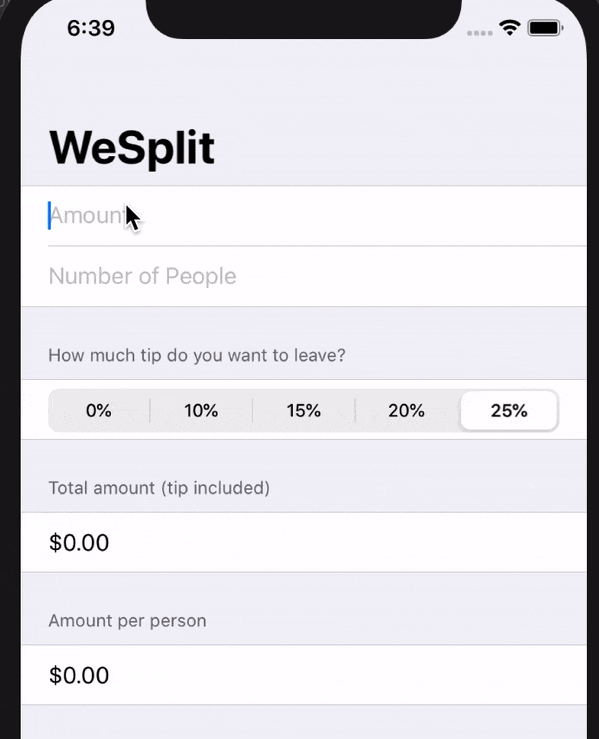

# WeSplit

It's cheque calculator application built using SwiftUI. It's from [project 1](https://www.hackingwithswift.com/100/swiftui/17)from day 17 of the 100 days of swiftUI series by @twostraws.

